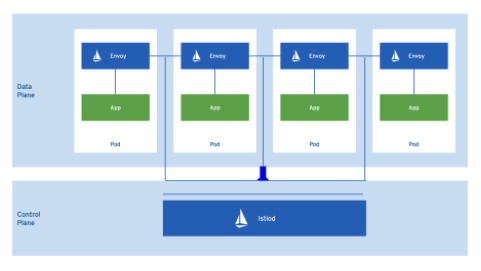
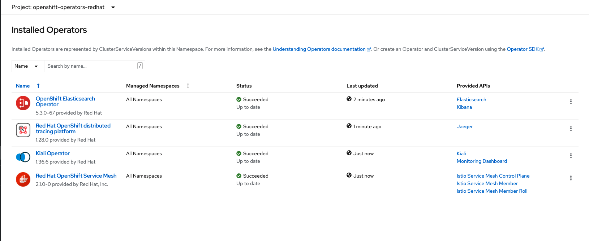

# What is RedHat OpenShift and how to install it

Voici un tutorial sur qu-est-ce que [**Red Hat OpenShift Service Mesh**](https://www.redhat.com/en/technologies/cloud-computing/openshift/what-is-openshift-service-mesh#:~:text=Red%20Hat%C2%AE%20OpenShift%C2%AE,microservices%20in%20your%20service%20mesh.) ainsi que comment faire son l'installation.

## Services en réseautique simple pour les applications Kubernetes d'entreprise.
[Red Hat OpenShift Service Mesh](https://www.redhat.com/en/technologies/jboss-middleware/codeready-workspaces) founit un outil unique pour connecter, gérer et surveiller les applications [microservice](https://www.redhat.com/fr/topics/microservices/what-are-microservices). Red Hat OpenShift Service Mesh offre une excellent niveau de contrôle et visibilité sur le comportement des différentes microservices en réseau qui y sont déployé dans la mesh. 

Le Service Mesh utilise un proxy de type `sidecar` par [Envoy](https://www.envoyproxy.io/) pour intercepter les communications réseau entre les microservices. `Red Hat OpenShift Service Mesh` repose sur le project libre 
[Istio](https://istio.io/).

### Raisons pour utiliser un ServiceMesh

1. Sécurisé la transmission entre les Workload. Utilisation de mTLS entre les services.
1. Configuration dynamique de la connection des services entre eux.
    * Politique de "Retry"
    * Circuit breeaker
    * deployment blue/green 
1. Observabilité de l'application end to end. Pas seulement qu'elle service est fonctionnel ou pas, mais voir ou sont les blocages, comment le traffic passe d'une place a l'autre ....
1. Controler les accès.
    * Contrôle qu'elle service peut appeler quoi
    * Get ou Post ....

---
## Table des matières
* [Caractéristiques Principales d'un ServiceMesh](#caracteristiques-principales-servicemesh)
 * [Architecture](#architecture)
 * [Prerequis](#prerequis)
 * [Installation des Operateurs](#installation-des-operateurs)
 * [Configuration du Service Mesh](#configuration-du-service-mesh)

---
### Caractéristiques Principales ServiceMesh
* Découverte de services
* Équilibrage de charge ( Load Balancing)
* Authentication service à service
* Récupération à l'échec ( Failure recovery)
* Métriques 
* Surveillence
* Testing A/B
* Canary Release
* Rate limiting
* Control des accès
* Authentication End-to-end

---
### Architecture

#### Composantes

* [Istio](https://istio.io/): Istio fourni le controle et le data plane qui sont les composante principale du `Service Mesh`. Il est opérationnalisé dans OpenShift avec l'opérateur `Red Hat OpenShift Service Mesh`.

* [Jaeger](https://www.jaegertracing.io/): Jaeger is un Open Source distributed tracing application. Il nous permet de tracer end-to-end une requête de façon centralisé sur plusieurs service. Grace a Jaeger nous pouvons plus facilement monitorer et trouver la cause d'un problème dans une architecture distribué. Il est opérationnalisé dans OpenShift avec l'opérateur `Red Hat OpenShift distributed tracing platform`.

* [ElasticSearch](https://www.elastic.co/): ElasticSearch est un Open source Engin de recherche et d'analytique distribué basé sur JSON. Il est utilisé par Jaeger pour storer et indexer les données de traçage.
Il est opérationnalisé dans OpenShift avec l'opérateur `OpenShift Elasticsearch Operator`.

* [Kiali](https://kiali.io/): Kiali est la console de gestion de Red Hat Service Mesh. Il fourni des dashboard, observabilité et de capacité de rebosted et de configuration robust. Grâce a Kiali on peut voir la structure de la Service Mesh en regardant la topology des service et ainsi voir la santé de notre service mesh. Il est opérationnalisé dans OpenShift avec l'opérateur `Kiali Operator`.

* [Grafana](https://grafana.com/)/[Prometheus](https://prometheus.io/): Grafana fourni des dashboard et Prometheus store les informations de télémétrie des services. Kiali est dépendant de Prometheus. Grafana et Prometheus viennent par défault dans la plateforme OpenShift.

--- 
### Prérequis

 * Un cluster OpenShift
 * Un compte administraeur pour se connecter au cluster

---
### Installation des Operateurs

Comme nous l'avons vu dans les composantes, Red Hat OpenShift Service Mesh s'appui sur plusieurs composantes, 4 opérateurs doivent donc être installé.

Tout les operators peuvent-être installé a partir de `Operators -> OperatorHub`. 

1. [OpenShift Elasticsearch Operator](docs/install-elastic-operator.md)
2. [Red Hat OpenShift distributed tracing platform](docs/install-jaeger-operator.md)
3. [Kiali Operator](docs/install-kiali-operator.md)
4. [Red Hat OpenShift Service Mesh](docs/install-ossm-operator.md)
5. [Configuration du Service Mesh](#configuration-du-service-mesh)

Un fois terminer on devrait voir les different Opérateurs sous `Operators -> Installed Operators`

---
### Configuration du Service Mesh

Maintenant que nous avons installé les opérateurs requis pour faire fonctionner le OpenShift Service Mesh nous devons la configurer.

[Installer le ServiceMesh Control Plane](docs/configure-ossm.md)
