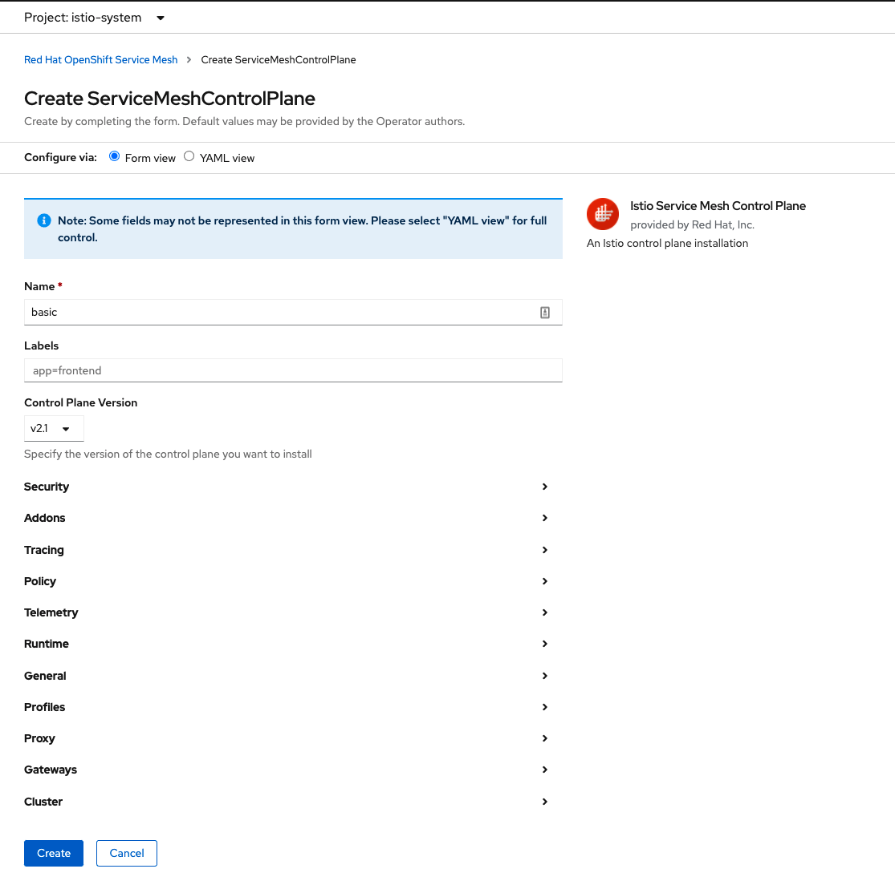

# Configuration de Openshift Service Mesh 

Il y a 2 partie importante dans un `service mesh`, le control plane et le data plane.

* `Control Plane`: Fournit une stratégie et une configuration pour tous les plans de données en cours d'exécution dans le maillage. Ne touche aucun paquet/demande dans le système. Le plan control plane transforme tous les plans de données en un système distribué. 

* `Data Plane`: Touche chaque paquet/demande dans le système. Responsable de la découverte des services, de la vérification de l'état, du routage, de l'équilibrage de charge, de l'authentification/autorisation et de l'observabilité.

### Étape 1 - Création du project 
* Se connecter au cluster OpenShift comme Administrateur
* Créer un nouveau project. `Home -> Projects-> Create Projects`

* Entrer le nom du project:  `istio-system`

* Click Create

### Étape 2 - Installation du Control Plane

* Sélectionner le project créé plus haut.  `istio-system`.

* Allez dans les opérateurs installé. `Operators -> Installed Operators`

* Sélectionner `Red Hat OpenShift Service Mesh Operator.

* Dans `Istio Service Mesh Control Plane` cliquer sur `Create instance`
     

*Cliquez sur `Create` 

> Nous pourrons changer des settings au besoins plus tard. Pour le moment nous allons laisser tout par défault

Étapes 3 - Création du Member Roll

Le ServiceMeshMemberRoll répertorie les projets qui appartiennent au plan de contrôle. Seulement les projets répertoriés dans le ServiceMeshMemberRoll sont affectés par le plan de contrôle. Un projet n'appartient pas à un maillage de services tant que vous ne l'avez pas ajouté au rôle de membre pour un déploiement de plan de contrôle particulier.

* Sélectionner le project créé plus haut.  `istio-system`.

* Allez dans les opérators installé. `Operators -> Installed Operators`

* Sélectionner `Red Hat OpenShift Service Mesh Operator.

* Dans `Istio Service Mesh Member Roll` cliquer sur `Create instance`

* Dans la section `Members`, mettre le nom du projet et cliquer `Create`

:tada: CONGRATULATIONS 

Le services mesh est maintant disponible sur le cluster.

:point_right: [Retour](../README.md)

