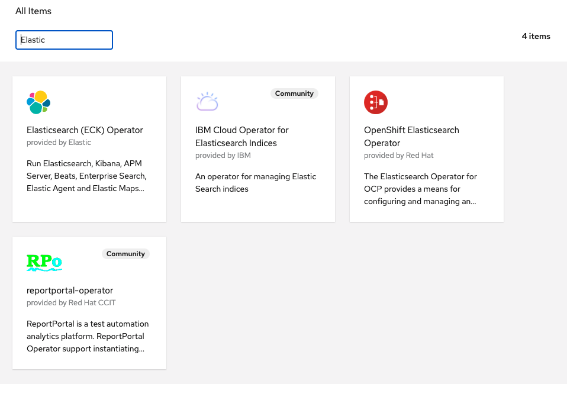
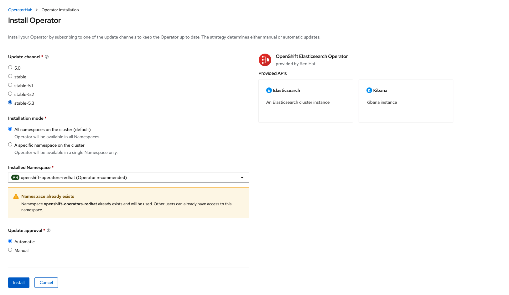

# Installer OpenShift Elasticsearch Operator

L'opérateur Elasticsearch pour OCP fournit un moyen de configurer et de gérer un cluster Elasticsearch à utiliser dans le traçage et la journalisation du cluster, ainsi qu'une instance Kibana pour s'y connecter. Cet opérateur prend uniquement en charge OCP Cluster Logging et Jaeger. Il est étroitement couplé à chacun et n'est actuellement pas capable d'être utilisé en tant que gestionnaire à usage général de clusters Elasticsearch exécutés sur OCP. Il est fourni en tant que module complémentaire au dessus de OpenShift et peut être installé via un opérateur disponible dans OpenShift OperatorHub.

## Étapes:

Tout d'abord, connectez-vous à la console OpenShift avec un utilisateur disposant de droit d'administration de cluster et assurez-vous que vous êtes du point de vue de l'administrateur, comme indiqué ci-dessous :

Ensuite, allez dans `Operators -> OperatorHub`. Vous devriez maintenant voir une liste des opérateurs disponibles pour OpenShift fournie par Red Hat, la communauté et nos partenaires.

Pour faciliter le processus, dans le `Filter by...`, tapez Elastic pour trouver l'opérateur requis :

Cliquez sur l'opérateur `OpenShift Elasticsearch` pour démarrer l'installation. 

Sélectionnez la version stable-5.x et cliquez sur `Installer` pour démarrer le processus d'installation.

:tada: FÉLICITATION

L'opérateur OpenShift Elasticsearch est maintenant installé dans le cluster d’OpenShift.

:point_right: Suivant: [Installation de OpenShift distributed tracing platform](install-jaeger-operator.md)

