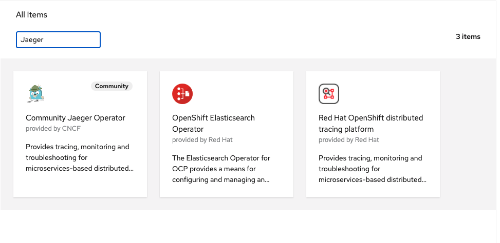
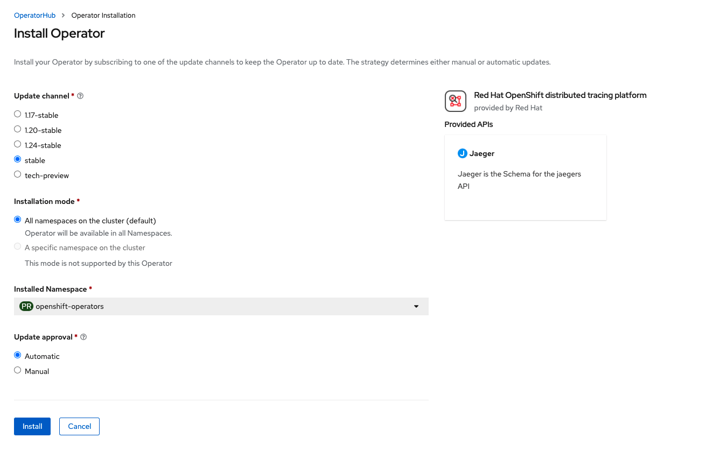

# Installer OpenShift distributed tracing platform

Le traçage distribué Red Hat OpenShift est basé sur Jaeger. Jaeger est un projet inspiré par Dapper et OpenZipkin. Il s'agit d'un système de traçage distribué publié en open source par Uber Technologies. Il est utilisé pour surveiller et dépanner les systèmes distribués basés sur des microservices. Il est fourni en tant que module complémentaire au dessus de OpenShift et peut être installé via un opérateur disponible dans OpenShift OperatorHub.

## Étapes:

Tout d'abord, connectez-vous à la console OpenShift avec un utilisateur disposant de droit d'administration de cluster et assurez-vous que vous êtes du point de vue de l'administrateur, comme indiqué ci-dessous :

Ensuite, allez dans `Operators -> OperatorHub`. Vous devriez maintenant voir une liste des opérateurs disponibles pour OpenShift fournie par Red Hat, la communauté et nos partenaires.

Pour faciliter le processus, dans le `Filter by...`, tapez Jaeger pour trouver l'opérateur requis :

Cliquez sur l'opérateur `Red Hat OpenShift distributed tracing platform` pour démarrer l'installation. Laissez le paramètre par défaut et cliquez sur `Installer` pour démarrer le processus d'installation.

:tada: FÉLICITATION

L'opérateur Red Hat OpenShift distributed tracing plarform est maintenant installé dans le cluster d’OpenShift.

:point_right: Suivant: [Installation de Kiali](install-kiali-operator.md)
