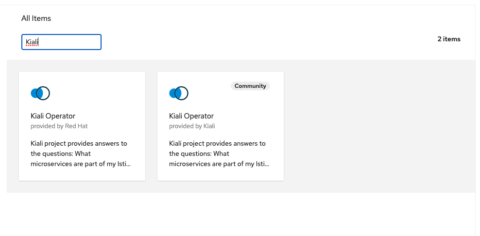
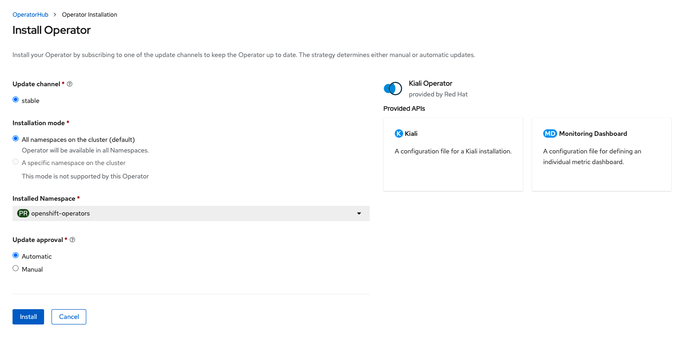

# Installer OpenShift Service Mesh operator

Une architecture de microservice divise le monolithe en plusieurs morceaux plus petits qui sont composés ensemble. Des modèles pour sécuriser la communication entre les services tels que la tolérance aux pannes (via le délai d'attente, la nouvelle tentative, la rupture de circuit, etc.) ont été mis en place, ainsi que le traçage distribué pour pouvoir voir où vont les appels.

Un service mesh peut désormais fournir ces services au niveau de la plate-forme et libère les rédacteurs d'applications de ces tâches. Les décisions de routage sont prises au niveau du maillage.

Kiali travaille avec OpenShift Service Mesh pour visualiser la topologie du service mesh, afin de fournir une visibilité sur des fonctionnalités telles que les disjoncteurs, les taux de demande, etc. Il offre des informations sur les composants du maillage à différents niveaux, des applications abstraites aux services et charges de travail.

 Il est fourni en tant que module complémentaire au dessus de OpenShift et peut être installé via un opérateur disponible dans OpenShift OperatorHub.

## Étapes:

Tout d'abord, connectez-vous à la console OpenShift avec un utilisateur disposant de droit d'administration de cluster et assurez-vous que vous êtes du point de vue de l'administrateur, comme indiqué ci-dessous :

Ensuite, allez dans `Operators -> OperatorHub`. Vous devriez maintenant voir une liste des opérateurs disponibles pour OpenShift fournie par Red Hat, la communauté et nos partenaires.

Pour faciliter le processus, dans le `Filter by...`, tapez Kiali pour trouver l'opérateur requis :

Cliquez sur l'opérateur `Kiali Operator` pour démarrer l'installation. Laissez le paramètre par défaut et cliquez sur `Installer` pour démarrer le processus d'installation.

:tada: FÉLICITATION

L'opérateur Kiali est maintenant installé dans le cluster d’OpenShift.

:point_right: Suivant: [Installation de OpenShift Service Mesh](install-ossm-operator.md)

