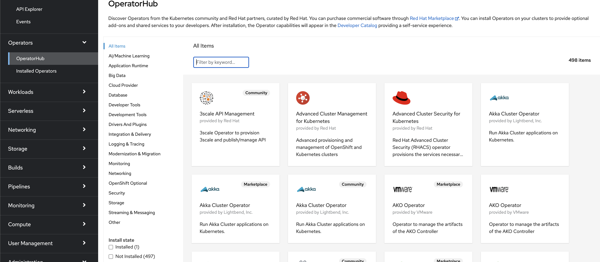

# Install OpenShift Service Mesh operator

Red Hat OpenShift Service Mesh dst une plate-formes qui fournit des informations comportementales et un contrôle opérationnel sur un `service mesh`, offrant un moyen uniforme de connecter, sécuriser et surveiller les applicaitons de microservices. Il est fourni en tant que module complémentaire au dessus de OpenShift et peut être installé via un opérateur disponible dans OpenShift OperatorHub.

## Étapes:

Tout d'abord, connectez-vous à la console OpenShift avec un utilisateur disposant de droit d'administration de cluster et assurez-vous que vous êtes du point de vue de l'administrateur, comme indiqué ci-dessous :

Ensuite, allez dans `Operators -> OperatorHub`. Vous devriez maintenant voir une liste des opérateurs disponibles pour OpenShift fournie par Red Hat, la communauté et nos partenaires.

Pour faciliter le processus, dans le `Filter by...`, tapez Service Mesh pour trouver l'opérateur requis :

Cliquez sur l'opérateur Red Hat OpenShift Service Mesh pour démarrer l'installation. Laissez le paramètre par défaut et cliquez sur `Installer` pour démarrer le processus d'installation.

:tada: FÉLICITATION

L'opérateur Red Hat OpenShift Service Mesh est maintenant installé dans le cluster d’OpenShift.

:point_right: Retour: [Configuration du Service Mesh](../README.md#configuration-du-service-mesh)

